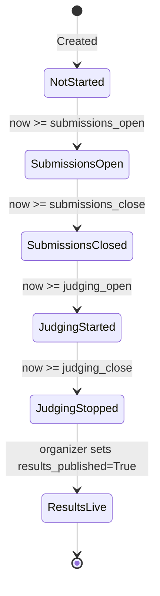

# 🏛️ HackForge — System Architecture & Design Rationale

> **"Build the platform that will judge you."**  
> *Architectural blueprint for an open-source, self-hostable, offline-capable hackathon platform.*

---

## 1. Architectural Philosophy & Principles

HackForge was designed around three non-negotiable architectural constraints established in the DOGFOOD 2026 specification:

1. **The One-Command Offline Rule:**  
   The entire system must run on a laptop with the network disconnected. No external cloud authentication, no hosted databases, no third-party email APIs, and no CDN dependencies. Bootstrapped with `docker compose up`, it initializes an end-to-end operational platform seeded with 10 multi-state hackathons.
2. **Backend-Enforced Role Isolation:**  
   Security is never delegated to the UI. If a user tries to access unauthorized data via `curl` or manual HTTP requests, the backend must immediately return `401 Unauthorized` or `403 Forbidden`.
3. **Multi-Event Adoptability:**  
   Rather than hardcoding a single hackathon, HackForge is multi-tenant by design. One instance can host concurrent or sequential hackathons with completely independent participants, rubrics, tracks, and judges.

---

## 2. Technology Stack & Component Structure

```
HackForge/
├── src/
│   ├── auth.py              # Cryptographic HMAC sessions, bcrypt passwords, role guards
│   ├── avatar.py            # Zero-dependency SVG avatar generator based on email hash
│   ├── context.py           # Template context builder (injects user, role, event status)
│   ├── db.py                # SQLAlchemy 2.0 engine, declarative base, session factory
│   ├── main.py              # FastAPI application bootstrap, lifespan, exception handlers
│   ├── models.py            # Complete declarative database schema (21 tables)
│   ├── queries.py           # Core business logic, Z-score math, ELO solver, query helpers
│   ├── seed.py              # Fixture loader, multi-event generator (evt_01 to evt_10), TOML writer
│   ├── seed_assets.py       # Curated procedural banners and project cover asset generator
│   ├── templating.py        # Jinja2 environment setup and custom markdown/date filters
│   ├── timeutil.py          # Strict UTC timezone parsing, normalization, and comparison
│   ├── webhooks.py          # Async webhook engine, HMAC payload signing, judge record crypto
│   ├── routers/
│   │   ├── admin.py         # Global system administration & platform management
│   │   ├── auth.py          # Session login, registration, logout routes
│   │   ├── judge.py         # Rubric scoring, pairwise comparisons, auto-sync, judge dashboard
│   │   ├── notifications.py # In-portal activity notifications
│   │   ├── organizer.py     # Event setup, rubric weights, track assignments, CSV export, live audit
│   │   ├── participant.py   # Team management, join requests, matchmaking, project submission
│   │   ├── public.py        # Public gallery, project detail, event discovery & registrations
│   │   ├── t4.py            # T4 stretch: Webhooks, certificates, signed records, embeds, bulk JSON
│   │   └── voting.py        # T3 community peer voting, single-ballot transfers, comments, anti-abuse
│   ├── templates/           # Server-rendered semantic Jinja2 HTML templates
│   └── static/              # Semantic Vanilla CSS stylesheets, marked.js
├── tests/                   # Pytest test suite (67 tests across 16 test files covering T1–T4)
├── fixtures.json            # Official DOGFOOD hackathon dataset (40 projects, 30 judges)
├── run.py                   # Official acceptance checker
├── docker-compose.yml       # Production-ready offline container orchestration
└── Dockerfile               # Lean multi-stage Python container
```

---

## 3. Authentication & Session Architecture

### Cryptographic HMAC-SHA256 Tokenization

HackForge avoids heavy stateful session stores or external identity providers by employing stateless, tamper-proof HMAC tokens:

$$\text{Token} = \text{user\_id} \,\|\, \text{"."} \,\|\, \text{HMAC-SHA256}(\text{SESSION\_SECRET}, \text{user\_id})$$

1. **Generation:** When a user logs in, `make_session_token(user_id)` generates the signed string and sets a cookie with flags: `HttpOnly`, `SameSite=Lax`, `Path=/`.
2. **Dual Header Protocol:** Authentication accepts either browser cookies (`Cookie: session=<token>`) or API bearer headers (`Authorization: Bearer <token>`).
3. **Verification:** `parse_session_token(token)` extracts the `user_id`, recalculates the expected signature, and validates it using `hmac.compare_digest()` to eliminate timing-attack vulnerabilities.
4. **Fixture & Self-Registration Interoperability:**
   - Seeded test accounts have `password_hash = None`, allowing instant access with fixture passwords or pre-computed session cookies in `.dogfood.toml`.
   - New user self-registration uses salted bcrypt password hashing (`bcrypt.hashpw`).

---

## 4. Backend Role Isolation & Access Control

Role security is enforced strictly in Python through FastAPI's dependency injection system:

```
                      [ Incoming HTTP Request ]
                                  │
                                  ▼
                        get_current_user()
               (Validates HMAC cookie/Bearer against DB User)
                                  │
                                  ▼
                        require_role(*roles)
       (Inspects EventMember for event_id + checks role rank)
                                  │
                   ┌──────────────┴──────────────┐
                   ▼                             ▼
             [ Authorized ]                [ Unauthorized ]
             Executes Route             HTTP 401 / 403 Error
```

### Route-Level Segregation
Endpoints are physically separated by role into independent router modules:
- `src/routers/public.py`: Unauthenticated access to project gallery, event descriptions, registration flows, and avatar SVGs.
- `src/routers/participant.py`: Restricts team creation, invitations, join request approvals, and project submissions to verified participants.
- `src/routers/judge.py`: Strictly limits score submission and viewing to assigned judges. Peer score requests (`/api/judge/scores?judge=peer_id`) are intercepted and refused with `HTTP 403 Forbidden`.
- `src/routers/organizer.py`: Guards event configuration, rubric modifications, judge assignments, and raw CSV/audit exports behind organizer/admin verification.
- `src/routers/voting.py`: Restricts community votes to registered participants, blocking self-voting and non-participant attempts.
- `src/routers/t4.py`: Houses enterprise extensions (webhooks, verifiable certificates, full archival exports, and interactive documentation).

---

## 5. Event Lifecycle State Machine

HackForge handles hackathon scheduling deterministically using timezone-aware UTC timestamps:



### Deterministic Lifecycle Evaluation (`status_info`)
The event model evaluates state transitions dynamically based on `utcnow()`:
- **Not Started** (0% progress)
- **Submissions Open** (20% progress)
- **Submissions Closed** (40% progress)
- **Judging Started** (60% progress)
- **Judging Stopped** (80% progress)
- **Results Live** (100% progress)

### Deadline Enforcement
Deadline compliance is evaluated at the database query level:
```python
now = utcnow()
if event.submissions_close and now > as_utc(event.submissions_close):
    raise HTTPException(status_code=400, detail="Submissions for this event are closed")
```
No project creation or modification can bypass this check, guaranteeing that deadlines hold under automated inspection.

---

## 6. Scoring & Normalization Pipeline

HackForge includes a dual scoring engine: a multi-criteria weighted rubric normalized via Z-scores, and an experimental Bradley-Terry ELO pairwise comparator.

```
 [ Judge Submissions ]
          │
          ▼
 1. Raw Weighted Score
    Sum(Crit_Weight * Score) / Total_Weight
          │
          ▼
 2. Judge Statistical Profiling
    Track-level Mean (μ) and StdDev (σ) calculated per judge
          │
          ▼
 3. Z-Score Standardization
    Z = (Raw - μ) / σ
    Scaled_Score = 50 + (15 * Z)
          │
          ▼
 4. Project Aggregation
    Final Normalized Score = Mean(Scaled_Scores across judges)
          │
          ▼
 5. Pairwise Bradley-Terry ELO Solver
    Calculates expected win probability: P(A > B) = 1 / (1 + 10^((R_B - R_A)/400))
    Updates ratings: R' = R + K*(Actual - Expected)
          │
          ▼
 6. Rubric Auto-Sync
    Converts pairwise ELO ratings into standard Score records (clamped to [1, 10])
```

For full mathematical proofs, divide-by-zero proofs, and variance derivations, refer to [`JUDGING.md`](JUDGING.md).

---

## 7. T3 Public Community Features & Anti-Abuse

### Peer Voting Engine
- **Identity Gated:** Only users with an active `participant` membership in the event can cast community votes.
- **Single Ballot Constraint:** Enforced at the schema level via `UniqueConstraint("user_id", "event_id", name="uq_vote_user_event")`.
- **Atomic Transfer & Unvote:** Clicking another project transfers the participant's vote to that project; clicking the same project unvotes.
- **Self-Voting Prohibition:** When voting, `user_team(db, user.id, event.id)` is checked. If the user's team owns the target project, the backend aborts with HTTP 403: *"Self-voting is strictly prohibited"*.
- **Rate Limiting:** A sliding window tracker (`max_requests=10, window_seconds=60.0`) prevents script abuse.

### Results Hiding (Sealed Ballot)
To eliminate bandwagon bias where early leaders attract disproportionate votes:
- If `event.results_published` is `False`, all public APIs and template contexts hide vote tallies (`vote_count: null`, `results_hidden: true`).
- Organizers retain a dedicated view in their dashboard to monitor community participation in real time.

### Ballot Ordering Randomization
To prevent first-mover alphabetical advantages:
- The gallery endpoint supports `sort=random`.
- Ordering is shuffled using a deterministic seed based on the user session (`random.Random(user_seed)`). This guarantees stable pagination for a single user during their session while presenting a different, unbiased ordering to each visitor.

### Comprehensive Audit Trail
Every significant state mutation creates an unalterable record in `audit_logs`:
- User registration and role assignments
- Project submissions, cover image uploads, and updates
- Judge score submissions, conflict declarations, and pairwise comparisons
- Community vote casts, transfers, and revocations
- Comment creation and moderation deletions
- Webhook subscriptions and certificate generation

---

## 8. T4 Enterprise Extensions & Verifiable Credentials

### 1. Real-Time Webhooks Engine (`src/webhooks.py`)
- Allows external platforms and sponsors to register HTTP POST callback URLs (`POST /api/events/{event_id}/webhooks`).
- Dispatches asynchronous background deliveries with HMAC-SHA256 signature verification headers (`X-HackForge-Signature: sha256=...`), unique UUID delivery tracking (`X-HackForge-Delivery`), and logging to `WebhookDelivery`.

### 2. Verifiable Credentials & Certificates (`src/routers/t4.py`)
- Bulk generates tamper-evident participation and judging certificates (`/api/events/{event_id}/certificates/generate`).
- **Eligibility Guard:** Participation certificates are strictly gated (`_is_certificate_eligible`): only participants whose teams have submitted an eligible, non-draft, non-disqualified project receive certificates.
- Provides public authenticity verification (`/verify/certificate/{code}`) and standalone vector SVG rendering (`/api/certificates/{cert_id}/download`).

### 3. Cryptographically Signed Judge Participation Records
- Generates a tamper-proof participation record proving a judge's evaluations (`/api/judge/{event_id}/record`).
- Signs `judge_id:event_id:scores_count:timestamp` using a master server secret with verification at `/verify/record/{record_id}`.

### 4. Embeddable Responsive Gallery Widget
- Designed for external website `<iframe>` integration (`GET /embed/gallery/{event_id}`).
- Supports dynamic `theme=dark` or `theme=light`, track filtering, and custom project display limits.

### 5. Archival JSON Export & Bulk Project Import
- Comprehensive full database dump of an event (`/api/events/{event_id}/export/full.json`) including tracks, criteria, projects, scores, comments, community votes, and audit trail.
- Bulk project import endpoint (`/api/events/{event_id}/import/projects`) with duplicate title suppression and automatic team/member creation.

### 6. Interactive Role-Based API Documentation Portal (`/api/docs`)
- Dedicated documentation hub with tabbed views for Organizers, Judges, Participants, and Public visitors.
- Populates cURL command examples with the active session token of the logged-in user.

---

## 9. Design Decisions Worth Stealing

1. **Deterministic Procedural Avatars:** Zero network roundtrips. Identicons are generated on-the-fly as inline SVGs based on MD5 hashes of user emails, eliminating broken image links and third-party Gravatar trackers.
2. **Clean Server-Rendered Simplicity:** No hydration mismatches, no 200MB `node_modules` frontend build step, and no client-side routing bugs. Jinja2 templates paired with modern Vanilla CSS deliver sub-10ms page response times.
3. **Unified Dual-Paradigm Judging:** Organizers can seamlessly toggle between Raw Average, Z-score Normalized, and Pairwise ELO views on a single dashboard, while pairwise judgments automatically synchronize back to rubric scores.
4. **End-to-End Cryptographic Verifiability:** From signed session tokens to webhook deliveries, judge participation records, and attendance certificates, all external artifacts are tamper-evident.
