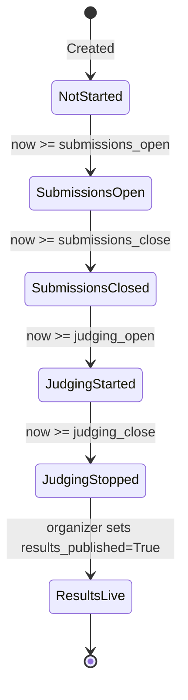

# 🏛️ HackForge — System Architecture & Design Rationale

> **"Build the platform that will judge you."**  
> *Architectural blueprint for an open-source, self-hostable, offline-capable hackathon platform.*

---

## 1. Architectural Philosophy & Principles

HackForge was designed around three non-negotiable architectural constraints established in the DOGFOOD 2026 specification:

1. **The One-Command Offline Rule:**  
   The entire system must run on a laptop with the network disconnected. No external cloud authentication, no hosted databases, no third-party email APIs, and no CDN dependencies.
2. **Backend-Enforced Role Isolation:**  
   Security is never delegated to the UI. If a user tries to access unauthorized data via `curl` or manual HTTP requests, the backend must immediately return `401 Unauthorized` or `403 Forbidden`.
3. **Multi-Event Adoptability:**  
   Rather than hardcoding a single hackathon, HackForge is multi-tenant by design. One instance can host concurrent or sequential hackathons with completely independent participants, rubrics, tracks, and judges.

---

## 2. Technology Stack & Component Structure

```
HackForge/
├── src/
│   ├── auth.py              # Cryptographic HMAC sessions, password verification, role guards
│   ├── avatar.py            # Zero-dependency SVG avatar generator based on email hash
│   ├── context.py           # Template context builder (injects user, role, event status)
│   ├── db.py                # SQLAlchemy 2.0 engine, declarative base, session factory
│   ├── main.py              # FastAPI application bootstrap, lifespan, exception handlers
│   ├── models.py            # Complete declarative database schema (16 tables)
│   ├── queries.py           # Core business logic, Z-score math, ELO solver, queries
│   ├── seed.py              # Offline fixtures loader, initial admin generator, TOML writer
│   ├── timeutil.py          # Strict UTC timezone parsing, normalization, and comparison
│   ├── routers/
│   │   ├── admin.py         # Global system administration & platform management
│   │   ├── auth.py          # Session login, registration, logout routes
│   │   ├── judge.py         # Rubric scoring, pairwise comparisons, judge dashboard
│   │   ├── organizer.py     # Event setup, rubric weights, track assignments, CSV export
│   │   ├── participant.py   # Team management, submission drafting, editing
│   │   ├── public.py        # Public gallery, project detail, event discovery
│   │   ├── voting.py        # T3 community peer voting, comments, anti-abuse endpoints
│   │   └── notifications.py # In-portal activity notifications
│   ├── templates/           # Server-rendered semantic Jinja2 HTML templates
│   └── static/              # Semantic Vanilla CSS stylesheets, marked.js
├── tests/                   # Pytest test suite (21 tests covering T1–T3)
├── fixtures.json            # Official DOGFOOD hackathon dataset (40 projects, 30 judges)
├── run.py                   # Official acceptance checker
├── docker-compose.yml       # Production-ready offline container orchestration
└── Dockerfile               # Lean multi-stage Python container
```

---

## 3. Authentication & Session Architecture

### Cryptographic HMAC-SHA256 Tokenization

HackForge avoids heavy stateful session stores or external identity providers by employing stateless, tamper-proof HMAC tokens:

$$\text{Token} = \text{user\_id} \,\|\, \text{"."} \,\|\, \text{HMAC-SHA256}(\text{SESSION\_SECRET}, \text{user\_id})$$

1. **Generation:** When a user logs in, `make_session_token(user_id)` generates the signed string and sets a cookie with flags: `HttpOnly`, `SameSite=Lax`, `Path=/`.
2. **Verification:** `parse_session_token(token)` extracts the `user_id`, recalculates the expected signature, and validates it using `hmac.compare_digest()` to eliminate timing-attack vulnerabilities.
3. **Seed Interoperability:** In fixture environments, seeded test accounts have `password_hash = None`, allowing instant access with fixture passwords or pre-computed session cookies in `.dogfood.toml`.

---

## 4. Backend Role Isolation & Access Control

Role security is enforced strictly in Python through FastAPI's dependency injection system:

```
                      [ Incoming HTTP Request ]
                                  │
                                  ▼
                        get_current_user()
               (Validates HMAC cookie against DB User)
                                  │
                                  ▼
                        require_role(*roles)
       (Inspects EventMember for event_id + checks role rank)
                                  │
                   ┌──────────────┴──────────────┐
                   ▼                             ▼
             [ Authorized ]                [ Unauthorized ]
             Executes Route             HTTP 401 / 403 Error
```

### Route-Level Segregation
Endpoints are physically separated by role into independent router modules:
- `src/routers/public.py`: Unauthenticated access to project gallery, event descriptions, and avatar SVGs.
- `src/routers/participant.py`: Restricts team creation, editing, and project drafting to verified participants.
- `src/routers/judge.py`: Strictly limits score submission and viewing to assigned judges. Peer score requests (`/api/judge/scores?judge=peer_id`) are intercepted and refused with HTTP 403.
- `src/routers/organizer.py`: Guards event configuration, rubric modifications, and raw CSV exports behind organizer/admin verification.
- `src/routers/voting.py`: Restricts community votes to registered participants, blocking self-voting and visitor attempts.

---

## 5. Event Lifecycle State Machine

HackForge handles hackathon scheduling deterministically using timezone-aware UTC timestamps:



### Deadline Enforcement
Deadline compliance is evaluated at the database query level:
```python
now = utcnow()
if event.submissions_close and now > as_utc(event.submissions_close):
    raise HTTPException(status_code=400, detail="Submissions for this event are closed")
```
No project creation or modification can bypass this check, guaranteeing that deadlines hold under automated inspection.

---

## 6. Scoring & Normalization Pipeline

HackForge includes a dual scoring engine: a multi-criteria weighted rubric normalized via Z-scores, and an experimental Bradley-Terry ELO pairwise comparator.

```
 [ Judge Submissions ]
          │
          ▼
 1. Raw Weighted Score
    Sum(Crit_Weight * Score) / Total_Weight
          │
          ▼
 2. Judge Statistical Profiling
    Track-level Mean (μ) and StdDev (σ) calculated per judge
          │
          ▼
 3. Z-Score Standardization
    Z = (Raw - μ) / σ
    Scaled_Score = 50 + (15 * Z)
          │
          ▼
 4. Project Aggregation
    Final Normalized Score = Mean(Scaled_Scores across judges)
          │
          ▼
 5. Pairwise Bradley-Terry ELO Solver
    Calculates expected win probability: P(A > B) = 1 / (1 + 10^((R_B - R_A)/400))
    Updates ratings: R' = R + K*(Actual - Expected)
```

For full mathematical proofs, divide-by-zero proofs, and variance derivations, refer to [`JUDGING.md`](file:///c:/Users/aksha/OneDrive/Documents/Hackathon%20Site/HackForge/JUDGING.md).

---

## 7. T3 Public Community Features & Anti-Abuse

### Peer Voting Engine
- **Identity Gated:** Only users with an active `participant` membership in the event can cast community votes.
- **Self-Voting Prohibition:** When voting, `user_team(db, user.id, event.id)` is checked. If the user's team owns the target project, the backend aborts with HTTP 403: *"Self-voting is strictly prohibited"*.
- **Ballot Cap:** A hard limit of 50 total votes per participant per event prevents automated script abuse.

### Results Hiding (Sealed Ballot)
To eliminate bandwagon bias where early leaders attract disproportionate votes:
- If `event.results_published` is `False`, all public APIs and template contexts hide vote tallies (`vote_count: null`, `results_hidden: true`).
- Organizers retain a dedicated view in their dashboard to monitor community participation in real time.

### Ballot Ordering Randomization
To prevent first-mover alphabetical advantages:
- The gallery endpoint supports `sort=random`.
- Ordering is shuffled using a deterministic seed based on the user session (`random.Random(user.id)`). This guarantees stable pagination for a single user during their session while presenting a different, unbiased ordering to each visitor.

### Comprehensive Audit Trail
Every significant state mutation creates an unalterable record in `audit_logs`:
- Event creation and date modifications
- Project submissions and updates
- Judge score submissions and rubric locking
- Community vote cast and revocation actions
- Comment creation and moderation deletions

---

## 8. Design Decisions Worth Stealing

1. **Deterministic Procedural Avatars:** Zero network roundtrips. Identicons are generated on-the-fly as inline SVGs based on MD5 hashes of user emails, eliminating broken image links and third-party Gravatar trackers.
2. **Clean Server-Rendered Simplicity:** No hydration mismatches, no 200MB `node_modules` frontend build step, and no client-side routing bugs. Jinja2 templates paired with modern Vanilla CSS deliver sub-10ms page response times.
3. **Dual Scoring Views:** Organizers can seamlessly toggle between Raw Average, Z-score Normalized, and Pairwise ELO views on a single dashboard without page refreshes, providing instant transparency into judging discrepancies.
